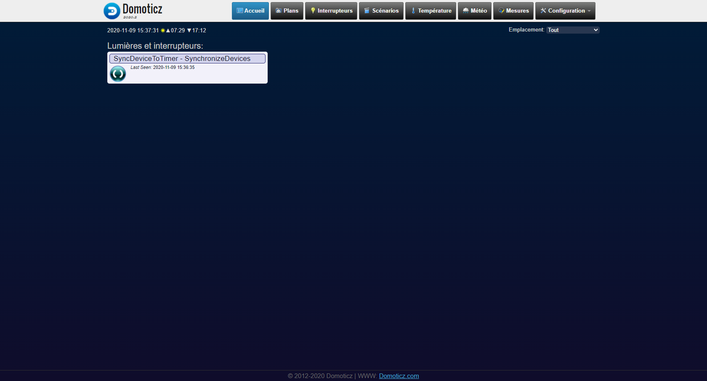

# Update_timer_Plugin

A simple Domoticz Python plugin to synchronize your devices on the corresponding active timer.

## Screenshot

## History

I'm actualy using Timer Plan to manage multiples timer on a device :
http://domo-attitude.fr/domoticz-editeur-de-planning/
And the excellent Syrhus plugin to have graphic interface :
https://github.com/syrhus/domoticz-weekly-planning

This plugin has been developed to synchronize devices state after a restart of Domoticz service or after changing Timer Plan. 

## Key Features

On create : 
* Create a virtual switch to synchronize devices

On start :
* Automaticly synchronize all devices 

## Configuration

### Plugin Parameters

| Field | Information|
| ----- | ---------- |
| IP Domoticz: | DNS name, Local host or IP V4 addresses |
| Port | The port that the Domoticz service is listening on. Default 8080 |
| Debug | When true the logging level will be much higher to aid with troubleshooting |

